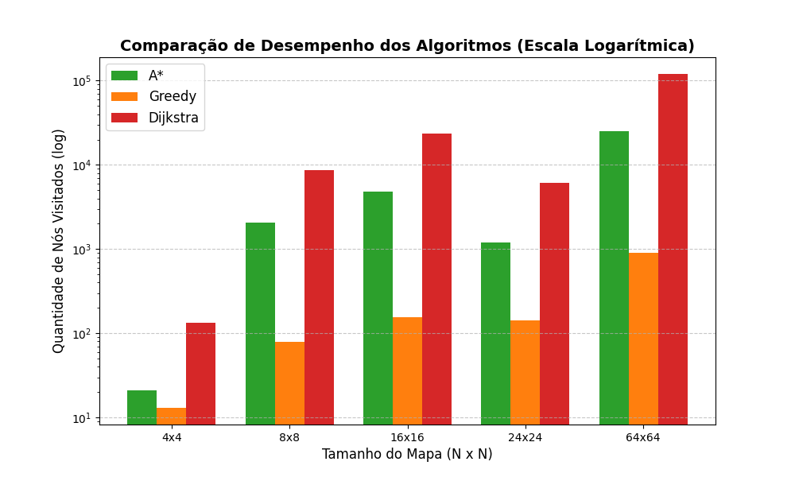

# 1. Visão Geral do Projeto

Esse projeto implementa um solucionador automatizado para uma variante do clássico jogo **Sokoban**,
utilizando algoritmos de Inteligência Artificial para busca de caminhos (Pathfinding).
O objetivo do jogo é fazer com que um agente (🙎) empurre ou carregue caixas para os alvos (🟢) no mapa,
desviando de paredes (🧱).

No jogo original, o objetivo é mover caixas até posições alvo. Nesta versão, foi adicionada uma mecânica adicional de peso nas caixas, transformando o problema em um caso de otimização de custo de transporte.
As caixas são numeradas de 1 a 9, e carregar uma caixa mais pesada aumenta o custo do movimento no algoritmo de busca, gastando mais energia. O objetivo do algoritmo é encontrar o caminho de menor custo total para entregar todas as caixas nos alvos.

O sistema resolve o problema utilizando três algoritmos de busca:

- [Dijkstra](#a-dijkstra)
- [Busca Gananciosa (Greedy Search)](#b-busca-gananciosa-greedy-search)
- [A*](#c-a)

Esses algoritmos exploram o espaço de estados do problema e retornam:

  - Caminho percorrido
  - Custo total da solução
  - Número de nós visitados
  - Tempo de execução

---

# 2. Regras de Negócio e Dinâmica do Jogo

<div align="center">

| Símbolo   | Significado    |
| --------- | -------------- |
| 🙎        | Agente         |
| 🧱        | Parede         |
| ⚪️        | Espaço livre   |
| 🟢        | Alvo           |
| 1️⃣ - 9️⃣ | Caixa e seu peso |

</div>

- **Agente (🙎):** 
   > _Move-se pelo mapa nas 4 direções (⬆️ cima, ⬇️ baixo, ⬅️ esquerda, ➡️ direita)._
- **Caixas (1️⃣ a 9️⃣):** 
  > _Cada uma tem um peso associado._
- **Pegar uma caixa:** 
   > _Se o agente se move para a posição de uma caixa e não está segurando nada, ele automaticamente a pega. O peso da caixa passa a ser carregado pelo agente._
- **Entregar uma caixa:** 
   > _Se o agente está segurando uma caixa e se move para um alvo (🟢), a caixa é entregue. O alvo é consumido e o agente fica livre para pegar outra caixa._
- **Custo de Movimento:**
   > | Situação | Custo |
   > |---------|-------|
   > | Agente sem caixa | 1 |
   > | Agente carregando caixa | 1 + peso da caixa |

- **Objetivo Final:** 
    > _Entregar todas as caixas em todos os alvos. O estado final ideal é quando não há mais caixas soltas no mapa e o agente não está segurando nada._

---

# 3. Estrutura do Projeto
```
scripts
 ├── benchmark.py
src
 ├── solucao.py
 ├── algorithms.py
 ├── entities.py
 ├── io_parser.py
 ├── problem.py
 ├── utils.py
gerar_mapa.py
solucao.py
```

O código foi dividido de forma modular para separar as responsabilidades:

### `solucao.py:`

É o ponto de entrada principal do programa. Responsável por ler os argumentos de linha de comando, carregar o mapa, executar os três algoritmos _(Dijkstra, Ganancioso e A*)_ e exportar os resultados para arquivos de texto.

### `gerar_mapa.py:`

Gera um mapa aleatório a partir de parâmetros de largura e altura (opcionais) em um arquivo de texto para ser usado como entrada do programa.

### `src/entities.py:`

Contém as estruturas de dados fundamentais (`State` e `Node`).

### `src/problem.py:`

Modela o problema de busca. Contém a lógica de transição de estados _(movimentação)_, cálculo de custo e a função heurística.

### `src/algorithms.py:` 

Implementa os algoritmos de busca _(Dijkstra, Busca Gananciosa e A*)_.

### `src/io_parser.py:`

Lida com a leitura do mapa a partir de um arquivo de texto e a escrita da solução gerada _(estado final, caminho tomado e nós visitados)_.

### `src/utils.py:` 

Funções utilitárias, como o mapeamento de números para emojis _(e vice-versa)_ e a tradução do caminho encontrado em setas _(➡️, ⬅️, ⬇️, ⬆️)_.

### `scripts/benchmark.py:`

Script para gerar o gráfico com os resultados dos testes de desempenho em diferentes tamanhos de mapa.

---

# 4. Representação do Estado

Um dos pontos mais importantes para algoritmos de IA é como o "estado do mundo" é representado na memória.
No arquivo `entities.py`, temos a classe `State` (Estado):

```python
@dataclass(frozen=True)
class State:
    agent_position: tuple[int, int]         # Posição (x, y) do agente
    holding: int | None                     # O peso da caixa que o agente está segurando (ou None)
    boxes: frozenset[...]                   # Conjunto de caixas restantes no mapa: ((x, y), peso)
    targets_positions: frozenset[...]       # Conjunto de posições (x, y) dos alvos restantes
    delivered_boxes: frozenset[...]         # Caixas já entregues (apenas para exibição visual)
```

---

### *Por que `frozenset` e `@dataclass(frozen=True)`?**

Os estados precisam ser imutáveis.
Como os algoritmos de busca guardam os estados já visitados em um dicionário ou conjunto (variável `visited`),
o estado precisa gerar um *hash* único e fixo. Modificar um estado em andamento corromperia a busca.
Sempre que o agente se move, um **novo** objeto `State` é criado em `problem.py`.

A classe `Node` (Nó) envolve o `State` adicionando os dados necessários para a árvore de busca:
- `parent`: O nó pai (de onde viemos, útil para reconstruir o caminho no final).
- `cost`: O custo acumulado desde o início até este estado ($`g(n)`$).
- `heuristic`: O valor da heurística estimada até o fim ($`h(n)`$).
- `total`: A soma do custo e da heurística ($`f(n) = g(n) + h(n)`$).

---

# 5. Algoritmos de Busca Utilizados

O solucionador implementa três abordagens diferentes. Todos usam uma Fila de Prioridade (Heap),
mas a forma como ordenam essa fila muda completamente o comportamento da busca.

## A. Dijkstra
- **Como funciona:** Explora sempre o caminho com o **menor custo acumulado** até o momento (olha apenas para o passado/presente).
- **Vantagem:** Garante encontrar a solução ótima (caminho de menor custo).
- **Desvantagem:** É "cego". Ele não sabe onde está o objetivo, então se espalha por todas as direções de maneira uniforme. É o mais lento e visita o maior número de nós.
- **Fórmula de prioridade:** Baseado apenas em $g(n)$ (Custo acumulado).

## B. Busca Gananciosa (Greedy Search)
- **Como funciona:** Explora sempre o nó que **parece estar mais perto do objetivo**, baseando-se exclusivamente na função heurística (olha apenas para o futuro).
- **Vantagem:** É muito rápido e visita poucos nós, pois vai direto na direção que a heurística aponta.
- **Desvantagem:** Não garante a solução ótima. Pode fazer escolhas ruins logo no começo (pegar um caminho de custo muito alto) só porque parecia estar mais perto visualmente.
- **Fórmula de prioridade:** Baseado apenas em $h(n)$ (Heurística).

## C. A*
- **Como funciona:** Une o melhor dos dois mundos. Ele tenta minimizar o custo total do caminho, considerando o que já gastou e o que ainda vai gastar.
- **Vantagem:** Garante a solução ótima (desde que a heurística seja admissível) e é muito mais rápido/direcionado que o Dijkstra.
- **Fórmula de prioridade:** Baseado em $f(n) = g(n) + h(n)$ (Custo acumulado + Heurística).

___
# 6. Função Sucessora
A função sucessora gera todos os estados possíveis a partir do estado atual para todas as direções possíveis.
```
problem.py → generate_successors()
```
O algoritmo realiza a verificação de se a posição está dentro do mapa, se não existe parede, se existe caixa na posição, se a caixa pode ser carregada e se a caixa pode ser entregue. Caso o movimento for válido, um novo estado é criado.

# 7. Função Objetivo
A função objetivo verifica se o problema foi resolvido.
```
problem.py → is_goal()
```
Com a condição de verificar se todas as caixas foram entregues e se o agente não está carregando mais nada.
```
len(state.boxes) == 0
AND
state.holding == None
```

# 8. A Função Heurística ($`h(n)`$)

A heurística (em `problem.py -> get_heuristic`) é uma "estimativa informada" de quanto custo ainda falta
para terminar o jogo a partir de um determinado estado. O cálculo é dividido em duas partes:

1. **Custo das Caixas Restantes:** Para cada caixa no mapa, calcula-se a Distância de Manhattan até o alvo mais próximo, multiplicada pelo peso da caixa (pois carregá-la até lá custará `1 + peso` por passo).
2. **Custo do Agente:** 
   - Se o agente **NÃO** estiver segurando uma caixa: Adiciona a distância dele até a caixa mais próxima (ele precisa andar até lá para pegar).
   - Se o agente estiver segurando uma caixa: Adiciona a distância dele até o alvo (🟢) mais próximo, multiplicado pelo custo de movimento com aquela caixa.

Essa heurística guia os algoritmos A* e Ganancioso para irem em direção às caixas e depois em direção aos alvos,
priorizando minimizar o trajeto das caixas mais pesadas.

---

# 9. Como Executar

Para rodar o projeto, utiliza-se o terminal apontando para o arquivo de entrada (se ele estiver no mesmo diretório do arquivo `solucao.py`):

```bash
python solucao.py mapa.txt
```

*(Opcional)* Você pode adicionar `--largura N` caso queira expandir o mapa para uma largura mínima fixa.

```bash 
python solucao.py mapa.txt --largura 10
```

O programa executará os três algoritmos em sequência, exibirá o tempo de execução e o custo total no terminal, e gerará três arquivos de saída (`dijkstra.txt`, `ganancioso.txt` e `a_estrela.txt`) detalhando o estado final, o caminho de setas para a vitória e o número de nós explorados.

## Adicional (Gerar Mapa Aleatório)

Caso queira gerar um mapa aleatório, basta rodar o arquivo `gerar_mapa.py`:

```bash
python gerar_mapa.py
```

*(Opcional)* Você pode adicionar `--largura N` e/ou `--altura M` para definir o tamanho do mapa e alterar o nome do arquivo de saída com `--saida mapa_aleatorio.txt`.

```bash
python gerar_mapa.py --largura 10 --altura 10 --saida mapa_aleatorio.txt
# ou somente
python gerar_mapa.py --altura 10
```

---

# 10. Estudo de caso
Para avaliar o desempenho dos algoritmos de busca, foi realizado um estudo comparativo utilizando gráfico com os devidos resultados.



O objetivo foi observar como o número de nós visitados cresce conforme o tamanho do grid aumenta.

O gráfico utiliza escala logarítmica, pois o crescimento do espaço de estados é exponencial.

Em todos os experimentos foram mantidas as mesmas configurações inciais, posições de caixas, alvos e regras de custo.

## ***4 x 4***
O menor espaço de estados do experimento.

   | Algoritmo | Nós visitados |
   | --------- | ------------- |
   | A*        | ~20           |
   | Greedy    | ~13           |
   | Dijkstra  | ~130          |

## ***8 x 8***
O espaço de busca ainda é relativamente pequeno.

   | Algoritmo | Nós visitados |
   | --------- | ------------- |
   | A*        | ~2.000        |
   | Greedy    | ~80           |
   | Dijkstra  | ~8.500        |

- Greedy visita poucos nós pois segue diretamente na direção da heurística.

- A* visita mais nós que Greedy, pois considera custo real + heurística.

- Dijkstra visita muito mais nós porque não possui orientação heurística.


## ***16 x 16***
O espaço de estados cresce significativamente.

| Algoritmo | Nós visitados |
| --------- | ------------- |
| A*        | ~4.500        |
| Greedy    | ~150          |
| Dijkstra  | ~23.000       |

- A diferença entre Dijkstra e os algoritmos informados (A e Greedy)* começa a aumentar.

- Greedy continua explorando poucos nós.

- Dijkstra explora uma grande quantidade de nós.

## ***24 x 24***
Em tese, o espaço de estados deveria crescer mais rapidamente.
Porém, como os testes foram realizados com uma geração aleatória de mapa,
possivelmente o mapa utilizado tinha uma solução particularmente mais simples que o comum.

| Algoritmo | Nós visitados |
| --------- | ------------- |
| A*        | ~1.200        |
| Greedy    | ~140          |
| Dijkstra  | ~6.000        |

- Greedy continua sendo o mais rápido.

- A* mantém desempenho intermediário.

- Dijkstra permanece sendo o mais custoso.

## ***64 x 64***
Claramente o efeito da explosão combinatória do espaço de estados.

| Algoritmo | Nós visitados |
| --------- | ------------- |
| A*        | ~24.000       |
| Greedy    | ~900          |
| Dijkstra  | ~120.000      |

- Dijkstra torna-se extremamente caro computacionalmente.

- Greedy continua rápido, mas pode gerar soluções subótimas.

- A* apresenta o melhor equilíbrio entre eficiência e qualidade da solução.
